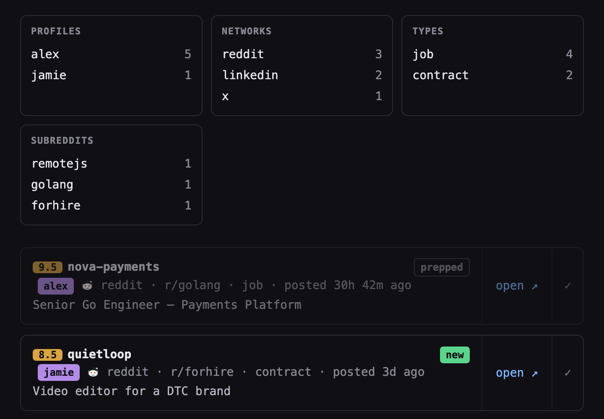
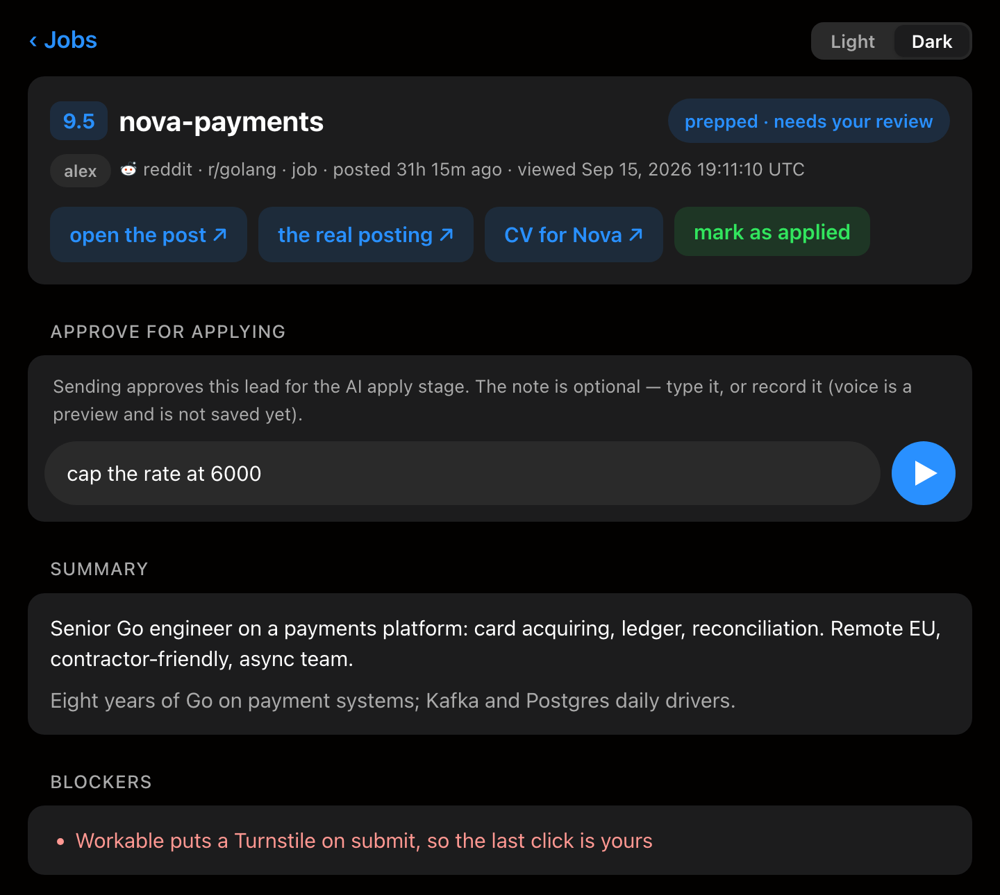

# jobhub

Run your job hunt on autopilot — without handing over the wheel. Point your
AI agents at jobhub and they scan the internet for roles that match your
skills, score them onto your board, prep each application, and apply — but
nothing is ever sent until you've approved it.

jobhub is the self-hosted hub of that loop: one Go binary, one SQLite file,
no accounts. A small JSON API for the agents, a dark little dashboard for
you, and a human approval gate between the two.



## How it works

Leads arrive as batches on `POST /api/jobs` and upsert by `dedupe_key`, so
re-running a sweep refreshes scores without duplicating rows or resetting
what you've already read. Each lead then walks a pipeline that lives in
columns on its own row:

- **found** → scored, with a mandatory `score_reason` (a bare `8` is not a
  judgement anyone can re-read a week later)
- **prepped** → an agent attaches a review artifact: summary, fit, what the
  application form asks, open questions, a tailored-CV link
- **approved** → the human gate; nothing gets applied to without it
- **applied / rejected** → rejections require a written reason, applications
  keep their date

The board is shared by any number of seekers via `profile`, filters compose
through query params (`?profile=&net=&type=&new=1&approved=1&since=7d…`), and
every board URL is also an API call — the JSON endpoint takes the same params.



Pages are gated by short per-page keys derived from a single secret
(`hex(HMAC-SHA256(VIEW_KEY, scope))[:8]`), so a shared link exposes one page,
not the whole board. Key guessing is rate-limited, everything is served with
`X-Robots-Tag: noindex` and a deny-all robots.txt.

## Run it

```sh
API_TOKEN=change-me VIEW_KEY=change-me-too go run ./cmd/jobhub
```

or with Docker:

```sh
docker build -t jobhub .
docker run -d -p 8080:8080 -v jobhub_data:/data \
  -e API_TOKEN=change-me -e VIEW_KEY=change-me-too jobhub
```

Push a first lead and open the link the response gives you:

```sh
curl -X POST localhost:8080/api/jobs -H 'Authorization: Bearer change-me' \
  -H 'Content-Type: application/json' -d '{"jobs":[{
    "dedupe_key":"example-1","network":"reddit","author":"someone",
    "title":"[HIRING] Senior Go dev","url":"https://example.com/post",
    "score":8,"score_reason":"stack match, remote, contract ok"}]}'
# -> {"added":1,"link":"/jobs?k=..."}
```

## Environment

| Var | Meaning |
| --- | --- |
| `API_TOKEN` | Bearer token for `/api/*` (required) |
| `VIEW_KEY` | Secret the page link keys are derived from (required) |
| `BASE_URL` | Public URL of the app, e.g. `https://board.example.com` (default `http://localhost:8080`) |
| `DB_PATH` | SQLite file (default `jobs.db`; the Docker image uses `/data/jobs.db`) |
| `PORT` | Listen port (default `8080`) |
| `DEFAULT_PROFILE` | Who owns leads pushed without a `profile` (default `me`) |
| `PROFILES` | Comma-separated seekers whose board chips exist before their first lead |
| `ELEVENLABS_API_KEY` | Enables voice notes: the approve composer's recordings are transcribed and saved as the review note. Unset, recording stays an on-page preview |
| `ELEVENLABS_STT_MODEL` | Speech-to-text model (default `scribe_v2`) |
| `ELEVENLABS_BASE_URL` | Override the ElevenLabs endpoint (proxies, tests) |

## API

All `/api/*` calls take `Authorization: Bearer $API_TOKEN`. `{id}` accepts a
row id or a `dedupe_key`.

| Endpoint | What it does |
| --- | --- |
| `POST /api/jobs` | Ingest a batch (`{"jobs":[…]}`); upserts by `dedupe_key`, non-empty fields win |
| `GET /api/jobs` | Leads as JSON; same filter params as the board |
| `POST /api/jobs/{id}/applied` | Mark applied (`{"applied":false}` undoes) |
| `POST /api/jobs/{id}/rejected` | Rule out: `{"reason":"…"}` required |
| `POST /api/jobs/{id}/approved` | Clear for applying (`{"approved":false}` undoes) |
| `POST /api/jobs/{id}/prep` | Attach the review artifact (opaque JSON; empty clears) |
| `POST /api/jobs/{id}/duplicate` | Link a repost to its canonical row (`{"of":"…"}`) |
| `DELETE /api/jobs`, `DELETE /api/jobs/{id}` | Purge everything / delete one lead |

The board's own buttons (approve, applied, notes) post with the page's link
key instead of the API token, so the review works from a phone. That includes
`POST /jobs/{id}/voice`: the composer records a voice note in the browser,
posts the audio there, and the ElevenLabs transcript is saved as the review
note while the lead is approved — the spoken version of typing a caveat and
hitting send.

## License

[MIT](LICENSE)
